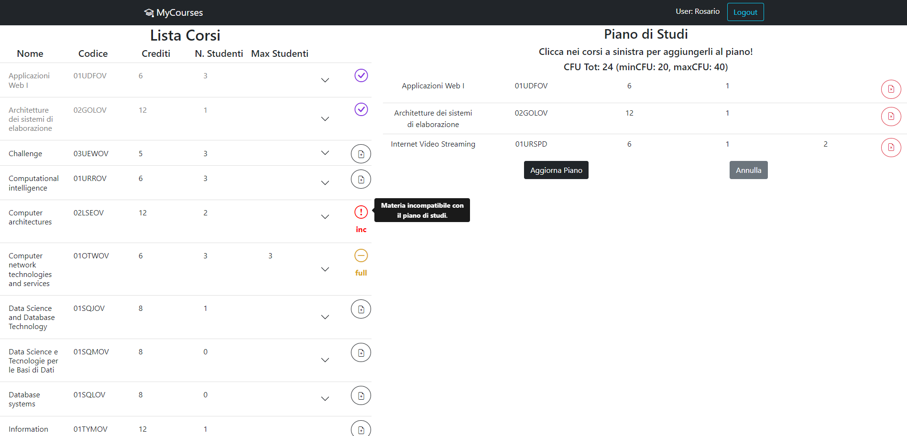

# Project: Piano di Studi
## General informations 

This is a solo university project for the 'Web Application I' course, made by myself (fullstack).

At the moment all the informations are in italian, i'll translate it later in english but if you need it make an issue and i'll do it as soon as possible!

## React Client Application Routes

- Route `/`: homepage, viene visualizzata la lista dei corsi e il piano di studi (se esiste, se no lo si può creare.) con due bottoni per la modifica e l'eliminazione complessiva del piano.
- Route `/login`: lista dei corsi e login, serve a poter accedere al proprio profilo studente se non si è autenticati.
- Route `/add`: lista dei corsi e un form per scegliere il tipo di piano di studi, successivamente sarà possibile visualizzare il piano "locale" durante l'inserimento dei corsi.
- Route `/update`:  lista dei corsi e il piano "locale" contenente i corsi aggiunti; serve a poter modificare il piano di studi.

## API Server
## GET METHODS

### GET `/api/corsi`
* Ritorna la lista completa dei corsi offerta dalla web application
* **Request body**: empty
* **Request response**: `200 OK` (success); body: Un array di oggetti ognuno con: codice, nome, crediti, maxstudenti, nstudenti, propedeutica, inc (vettore incompatibilità).
* **Response body**:
```
[
    {
        "codice": "01UDFOV",
        "nome": "Applicazioni Web I",
        "crediti": 6,
        "maxstudenti": null,
        "nstudenti": 3,
        "propedeutica": null,
        inc: inc: ["01TXYOV"]
    },
    ...
]
```
* **Error responses**: `500 Internal Server Error` (generic error).

### GET `/api/piano`
* Ritorna un oggetto con la lista completa dei corsi presenti nel piano di studi dell'utente autenticato e il tipo di piano
* **Request body**: empty
* **Request response**: `200 OK` (success); body: Un oggetto contenente il tipo di piano di studi e un array di oggetti ognuno con: codice, nome, crediti, maxstudenti, nstudenti, propedeutica, inc (vettore incompatibilità).
* **Response body**:
```
    {   "tipo": 'fulltime',
        courses: [{
            "codice": "01UDFOV",
            "nome": "Applicazioni Web I",
            "crediti": 6,
            "maxstudenti": null,
            "nstudenti": 3,
            "propedeutica": null,
            inc: ["01TXYOV", ...]
          },
          ...]
    },
```
* **Error responses**: `401 Unauthorized` (not logged in), `500 Internal Server Error` (generic error).

### GET `/api/sessions/current`
* Ritorna un oggetto che descrive l'utente autenticato e il tipo di piano di studi (se esiste) dell'utente autenticato.
* **Request body**: empty
* **Response header**: `200 OK` (success);
* **Responde body**: Un oggetto che descrive l'utente e il tipo di piano di studi (se esiste)
```
{
    "id": 1,
    "name": John,
    "tipo": parttime,
    "username": j@p.it
}
```
* **Error responses**: `401 Unauthorized` (not logged in or wrong permissions), `422 Unprocessable Entity` (validation of req.body failed), `503 Service Unavailable` (generic error).

## POST METHODS

### POST `/api/piano`
* Aggiunge un piano di studi all'utente
* **Request header has a line**: `Content-Type: application/json`.
* **Request body**: Oggetto che contiene il tipo di corso (type) e una lista di codici dei corsi da aggiungere (cor)
```
{
    "type": fulltime,
    "cor: ["01UDFOV", ...]
}
```
* **Response header**: `201 created` (success);
* **Responde body**: empty
* **Error responses**: `401 Unauthorized` (not logged in or wrong permissions), `422 Unprocessable Entity` (validation of req.body failed), `503 Service Unavailable` (generic error).

### POST `/api/sessions`
* Effettua l'autenticazione dell'utente
* **Request header has a line**: `Content-Type: application/json`.
* **Request body**: Oggetto che contiene l'username e la password dell'utente
```
{
    "username": j@p.it,
    "password: password
}
```
* **Response header**: `200 OK` (success);
* **Responde body**: Un oggetto che descrive l'utente e il tipo di piano di studi (se esiste)
```
{
    "id": 1,
    "name": John,
    "tipo": parttime,
    "username": j@p.it
}
```
* **Error responses**: `401 Unauthorized` (not logged in or wrong permissions), `422 Unprocessable Entity` (validation of req.body failed), `503 Service Unavailable` (generic error).

## PUT METHODS

### PUT `/api/piano`
* Modifica il piano di studi dell'utente
* **Request header has a line**: `Content-Type: application/json`.
* **Request body**: Oggetto che contiene il tipo di corso (type) e una lista di codici dei corsi da aggiungere (cor)
```
{
    "type": fulltime,
    "cor: ["01UDFOV", ...]
}
```
* **Response header**: `200 OK` (success);
* **Responde body**: empty
* **Error responses**: `401 Unauthorized` (not logged in or wrong permissions), `422 Unprocessable Entity` (validation of req.body failed), `503 Service Unavailable` (generic error).

## DELETE METHODS

### DELETE `/api/piano` 
* Elimina il piano di studi dell'utente
* **Request header**: none
* **Request body**: none
* **Response header**: `204 No Content` (success)
* **Response body**: none
* **Error responses**: `401 Unauthorized` (not logged in or wrong permissions), `503 Service Unavailable` (generic error).

### DELETE `/api/sessions` 
* Effettua il logout
* **Request header**: none
* **Request body**: none
* **Response header**: none
* **Response body**: none
* **Error responses**: `401 Unauthorized` (not logged in or wrong permissions)

## Database Tables

- Table `user` - contains id (chiave primaria), email, password, name, salt, tipopiano (identifica l'utente)
- Table `course` - contains codice (chiave primaria), nome, crediti, maxstudenti, propedeutica (contiene i corsi)
- Table `incompatibility` - contains codice1, codice2 (bridge table per le incompatibilità tra corsi, chiave primaria composta (codice1,codice2) a courses(codice))
- Table `studyplan` - contains codice, id (bridge table che contiene tutti i corsi del piano di studi di un utente identificato da id, chiave composta (id,codice) con id come chiave esterna ad user(id) e codice come chiave esterna a course(codice))

## Main React Components

- `ListaCorsi` (in `ListaCorsi.js`): componente per visualizzare la lista dei corsi, genera n (n numero corsi) componenti RigaCorso.
- `RigaCorso` (in `ListaCorsi.js`): componente per visualizzare il singolo corso, è espandibile per vedere la propedeuticità e le incompatibilità.
- `ListaCorsiEditable` (in `ListaCorsi.js`): componente per visualizzare la lista dei corsi in modalità di modifica, genera n (n numero corsi) componenti RigaCorsoEditable.
- `RigaCorsoEditable` (in `ListaCorsi.js`): componente per visualizzare il singolo corso in modalità di modifica, è possibile cliccare sul bottone di aggiunta per aggiungerlo al piano di studi.
- `PianoStudiForm` (in `PianoStudi.js`): questo componente serve per poter creare (modificare) un nuovo piano di studi, dopo la scelta del tipo di piano, sarà possibile visualizare e gestire i corsi aggiunti al piano.
- `DeletableCorsi` (in `PianoStudi.js`): descrive il corso all'interno di un determinato piano di studi, ha un bottone per eliminare il corso dal piano in fase di creazione (modifica).
- `ListaPiano` (in `PianoStudi.js`):  genera n (n numero corsi del piano) componenti Corsi per la visualizzazione della lista dei corsi del piano di studi di uno studente attualmente autenticato.
- `Corsi` (in `PianoStudi.js`): descrive il corso all'interno di un determinato piano di studi.
- `LoginForm` (in `Login.js`): contiene un form per effettuare il login.
- `LogoutButton` (in `Login.js`): Bottone utilizzato per effettuare il logout, è presente nel componente "Navbar".


(only _main_ components, minor ones may be skipped)

## Screenshot



## Users Credentials

- j@p.it, password (part-time)
- m@p.it, password (full-time)
- r@p.it, password (part-time)
- o@p.it, password (empty)
- s@p.it, password (part-time)

